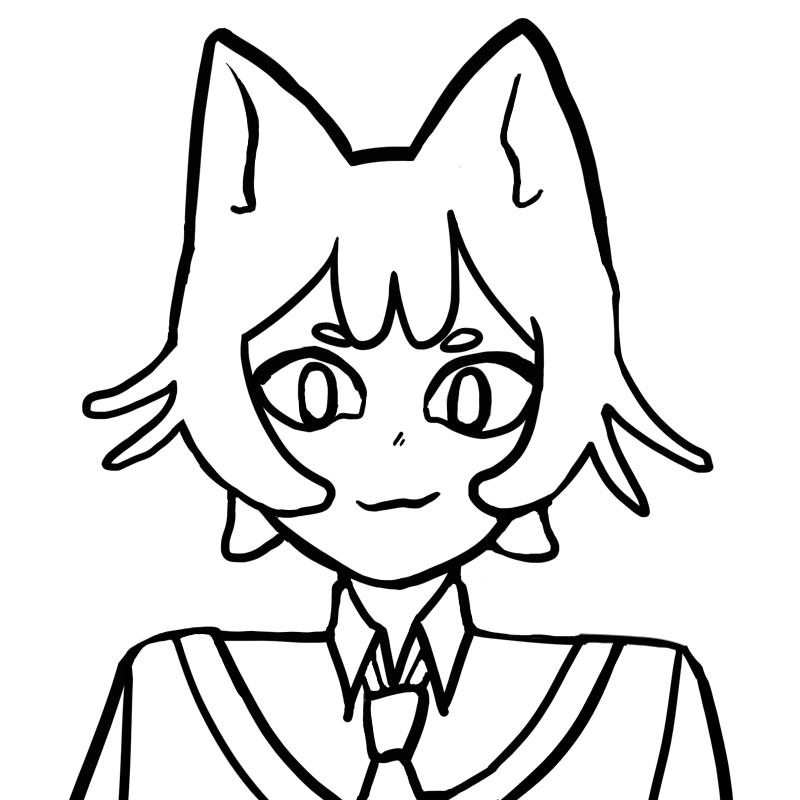
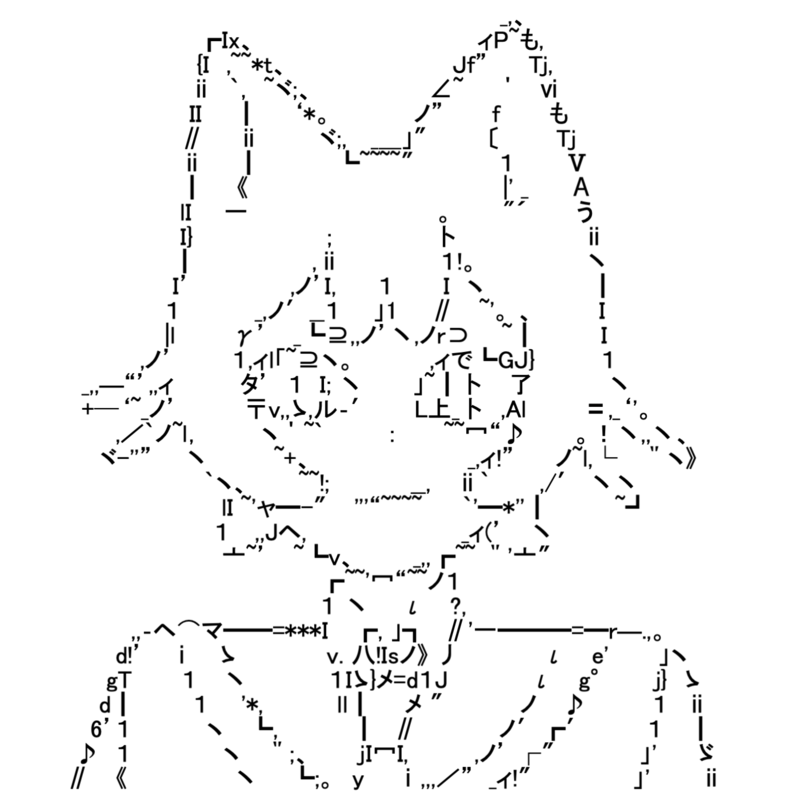
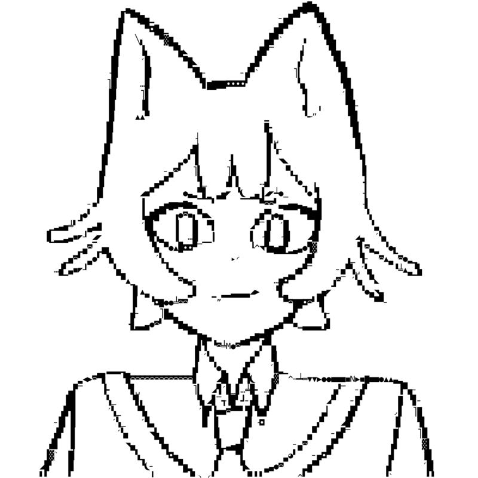

# Giko Tracer

Input | MS PGothic | MesloLGS Nerd Font
|:---:|:---:|:---:|
|  *Reference image* |  *Proportional font, 32 characters tall* |  *Monospace font, 64 characters tall*

Giko Tracer is a project to convert images into ASCII and ASCII-adjacent art.

> ASCII and ASCII-adjacent art is collectively referred to as AA.

## Key Features
- Ascii art generated with contour tracing
    - Compact and detailed ascii art
- Based on unicode encoding
- Font agnostic
- Supports proportional fonts
- Written in C
    - Fast and lightweight

### Components
- libgiko: an API library
- giko-trace: a CLI tool to convert images into ascii art

## Build
### Dependancies
- gcc
- pkg-config
- freetype2
- magick
    - ImageMagick might already be installed as part of your OS / distribution.
    - Check with ```magick --version```.
    - Otherwise, install with your favourite package manager or build from source.

To build both libgiko and giko-trace, run the following commands:
```
git clone https://github.com/cwid1/Giko-tracer.git
cd giko-tracer
make
```

## Install
### Giko Trace
After building, install giko-trace on the system level by running:
```
sudo cp giko-trace /usr/local/bin
```

### Libgiko
If installing libgiko system wide, simply copy the `giko.h` file into the system's `include` directory, and the `libgiko` files in `build` to the system's `share` directory.
## Fonts
AA art, like all art forms, have varying styles and forms. These styles have their own associated (1) font face, and (2) character set.  Provided in the `charsets` folder are some character sets customised for different AA styles.

- `classic_ascii` uses all 95 printable ASCII characters. Rustic and robust. Consider modifying it to restrict the codespace even further.

- `ms_pgothic` character sets are for recreating early 2000s Japanese AA, first appearing on internet forums and boards.

- `meslolgs_nf` character sets are for making art viewable on the terminal.

Due to copyright, and to reduce the size of the repository, the MS_PGothic and MesloLGS_NF font files are not included in this repository. If you wish to use these fonts, please source copies yourself.

## Giko-trace CLI Tool

### Basic Usage Example:
```
giko-cli -c charsets/classic_ascii.txt -f ms_pgothic.ttf -i assets/sample.png -o out.txt
```

### Basic Options
- `-c` or `--charset`: Text file containing unicode codepoints.
    - These codepoints will be the allowable characters when generating AA.
    - Charsets files should have one number per line, with no empty lines.
    - The default encoding takes base 10 codepoints, but if you are providing a custom charset with hexadecimal encoding, you may set the base encoding with `-b 16` or `--base-encoding 16`.
- `-f` or `--font`: Font file.
    - Freetype (and by extension, Giko) supports most font face files (ttf, otf, fnt).
- `-i` or `--image`: Input image file.
    - ImageMagick (and by extension, Giko) supports most image types (png, jpg, bmp).
- `-o` or `--output`: Output text file.
    - If this is not specified, the AA will be printed to `stdout`.
- `-H` or `--height`: The number of rows in the output text.
    - Depending on the font face design, the exact number of rows cannot be guaranteed.
    - Default height is `32`.

### Advanced and Fine-tuning Options:
- `-k` or `--chunk-factor`: How "chunky" (wide) characters are. Used in proportional fonts.
    - Value between `0` and `1`
    - Default value is `0.5`.
    - The lower the value the more thin glyphs (e.g. ';' and '.') will be preferred.
    - The higher the value, the more thick glyphs (e.g. 'm', '⊃') will be preferred.
- `-a` or `--accuracy`: How closely the glyph traces the bitmap.
    - Value between `0` and `1`.
    - Default value is `0.5`
    - If the value is high, Giko will spend more time finding the perfect glyph to trace each chunk of the image.
- `-d` or `--denoise`: Denoise factor.
    - Value between `0` and `1`.
    - Default value is `0.05`.
    - Adding too much denoising will cause parts of the image to disappear.
- `-F` or `--fidelity`: How fine the lines are.
    - Set to either `LOW`, `MEDIUM` or `HIGH`.
    - `LOW` will output thick lines while `HIGH` will produce thinner and finer lines.
    - Default setting is `MEDIUM`.
- `-g` or `--glyph-map-order`: This option in combination with `chunk-factor` and `accuracy` optimises greed algorithms. What it does can be generalised to these statements:
    - If set to `DESCENDING`, Giko will prefer dense glyphs (e.g. '藏’， ‘█‘).
    - If set to `ASCENDING`, Giko will prefer light glyphs (e.g. '。', 'ノ').
    - If set to `NONE` Giko will prefer the codepoints that come earlier in the charset.
- `-n` or `--negate`: Invert the colours of the input image.
- `-v` or `--verbose`: Print the options list with their set arguments.

### Config File
To make your commands more succinct, options can be specified in a text file.

In config.txt:
``` charset_file=charsets/ms_pgothic/charset512.txt
image_file=assets/sample.png
font_file=fonts/ms_pgothic.ttf
output_file=out.txt
height=32
base_encoding=10
glyph_map_order=NONE
chunkiness=0.50
accuracy=0.50
denoise=0.05
fidelity=HIGH
negate=false
```
> This is the config used to generate `assets/ms_pgothic.png`

Then to pass these options to Giko Trace:
```
giko-trace -C config.txt
```
or
```
giko-trace --config config.txt
```
If options are omitted in the config file, they can be added on with flags.

## Libgiko API
Refer to `giko.h` for API documentation.

Compile packages built with Giko like this:
```
gcc -I/path/to/include -L/path/to/build/or/share/dir -lgiko ...
```

## Contributing
There's a lot to do around here! Here are some features to add and improve:

- Colour support
- Accurate height mapping (e.g. --height 32 outputs AA with 32 rows)
- Accounting for space between rows
- Output as image of AA rather than text
- Drawing text on top of AA
- Documentation

Feel free to fork the project and open a pull request!

## Appendix
Giko Neko is a cat whose caricature is drawn in Shift_JIS (an ASCII-adjacent encoding) art.

``` ☆ *　. 　☆
　　. ∧＿∧　 ∩　* ☆
* ☆ (=・∀・)≠ .
　. ⊂　   ノ* ☆
☆ * (つ ノ .☆
　　 (ノ
```
*Giko!*
